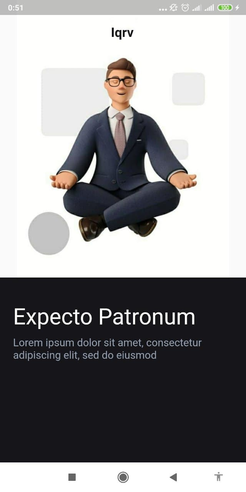
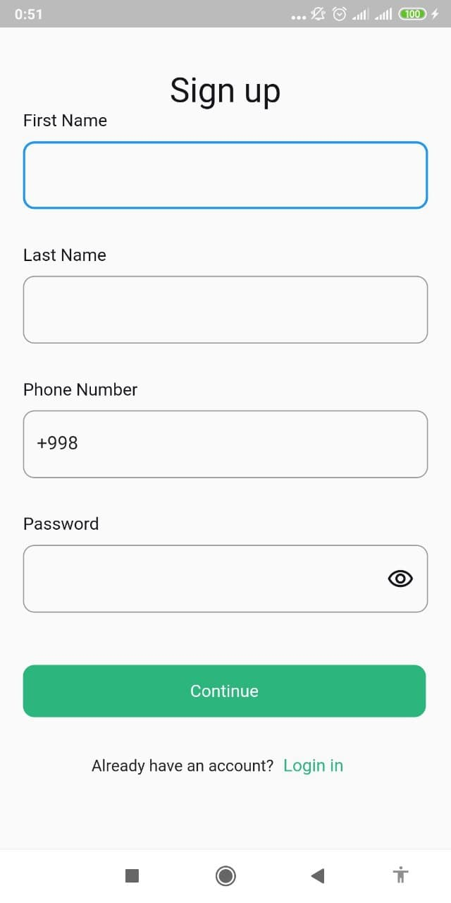
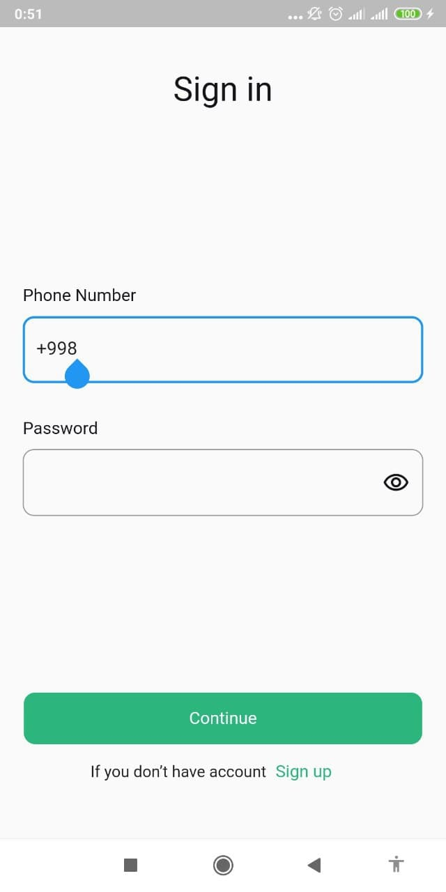
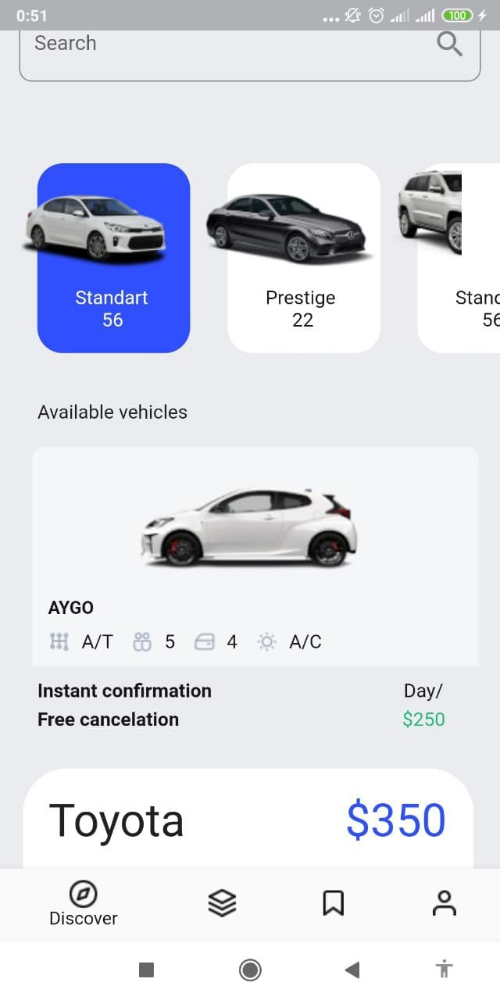
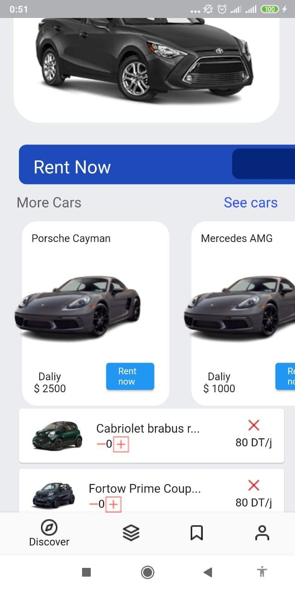

# Car Rental

A new Flutter exam.

## About app

## Pages

## Home Page

<a href> ="./lib/screens/">Splash</a> Splash Page Text va Image lardan tashkil topgan

<a href> ="./lib/screens/">SignUp</a> Sign Up ham asosan inputlardan tashkil topgan

<a href> ="./lib/screens/>SignIn</a> Sign In ham asosan inputlardan tashkil topgan

<a href> ="./lib/screens/">Home Pageda ListViewlar, Scrollar bor</a>

<a href> ="./lib/screens/">DetalisPage</a> Diologli Detalis Page

This project is a starting point for a Flutter application.

A few resources to get you started if this is your first Flutter project:

- [Lab: Write your first Flutter app](https://flutter.dev/docs/get-started/codelab)
- [Cookbook: Useful Flutter samples](https://flutter.dev/docs/cookbook)

For help getting started with Flutter, view our
[online documentation](https://flutter.dev/docs), which offers tutorials,
samples, guidance on mobile development, and a full API reference.
